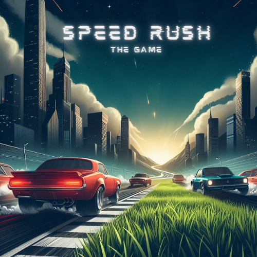
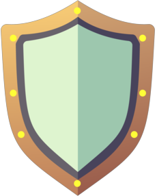
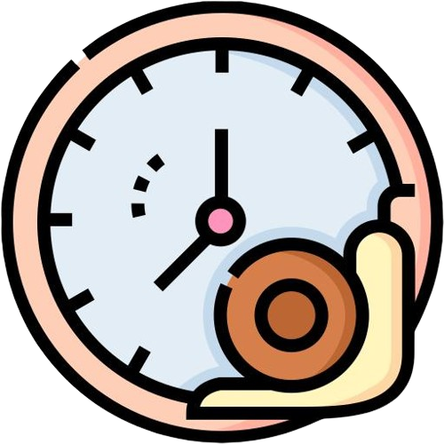
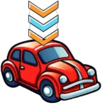

  

# Speed Rush Game 

Speed Rush Game is a simple and entertaining racing game. Your objective is to go as far as you can without running into oncoming cars. You can obtain a brief advantage by catching various power-ups while driving.

What are you waiting to try it? Come on, do your best!

## Content
1. Speed Rush Game
2. [Step one](#Step-one)
   - [Required conditions](#Required-conditions)
   - [Installation](#Installation)
3. [How to play](#How-to-play)
4. [Power Ups](#Power-Ups)
5. [Authors](#Authors)
6. [License](#License)

# Step One
### Required conditions
   - Python (version 3.10 or later)
     
### Installation
Note that these instructions are designed for Windows users in mind. You might need to modify the procedures if you're using a different operating system:

1. ### Download Anaconda from the [Anaconda website](https://www.anaconda.com/download).

2. ### Clone the Repository:
   - Open Anaconda Prompt.
   - Navigate to the directory where you want to clone the repository using the cd command.
   - Run the following command to clone the repository:

      `git clone https://github.com/vvdavilam/Computation_3.git`

3. ### Navigate to the Cloned Repository:
   - Change to the directory of the cloned repository:
       `cd Computation_3 `
   
4. ### Create and Activate Virtual Environment:
   - Create a new virtual environment (replace `your_environment_name` with your desired name):
      `conda create --name your_environment_name python=3.8`
   - Activate the virtual environment:
      `conda activate your_environment_name`

5. ### Install Dependencies:
   - Install Pygame:
      `pip install pygame`

6. ### Run the Game:
   - Execute the game using the following command:
      `python main.py`

# How to play
### Single player:
- To move your car in the desired direction, use the arrow keys.
- You will be confronting other cars that are going in the opposite way. You must keep from running into them if you want to live.
- You can also come across power-ups in addition to cars. Getting power-ups will give you a short-term advantage (or disadvantage).

### Multiplayer: 
Take part in an exciting race where the goal is to survive longer than your opponent. Should one of the players lose, the other player wins right away.
- You will have two roads.
- Player 1: Use 'WASD' keys.
- Player 2: Use arrow keys.
- Both roads will have cars coming in the opposite direction as well as power ups that will help them have some advantage (or disadvantage) for a period of time.

# Power Ups
Use these awesome power-ups to enhance your racing experience! During the game, they cause you to gain special benefits or disadvantages.

All power-ups last 5 seconds. If you are using any power-up and grab another one, you will continue using the power-up you had. It only changes the power-up when you are not using any power-up.

1. ### Invincibility:

  

   Get momentary invincibility to keep your car safe from collisions.

2. ### Slowing:

  

   Make oncoming vehicles slow down to facilitate navigating the traffic.

3. ### Small:  

  

   Reduces car size, making it easier to pass through traffic

4. ### Speeding:

  

   Make oncoming vehicles increase speed making it difficult to navigate traffic.

# Authors
- Margarida Ourives - 20221809
- Nayma Assis - 20221965
- Verónica Mendes - 20221945

# License 
Distributed under the MIT License. See [LICENSE.txt](LICENSE) for more information.

